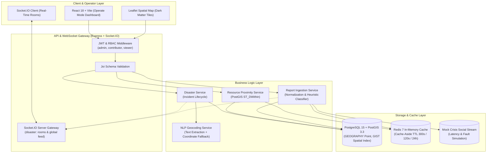
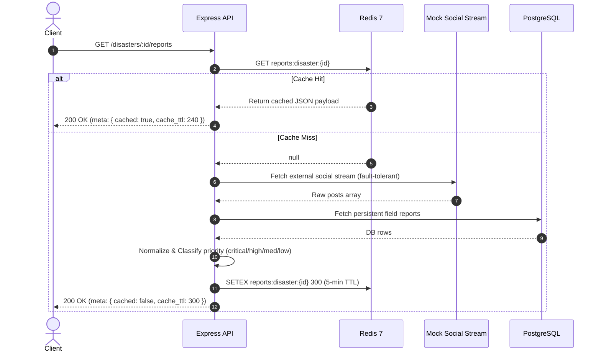

# Disaster Response Coordination Platform

[](https://postgis.net/)
[](https://redis.io/)
[](https://socket.io/)
[](https://expressjs.com/)
[](https://react.dev/)
[](https://www.docker.com/)

A mission-critical disaster response coordination platform engineered to manage disaster incidents, resolve crisis locations through natural language processing, perform geospatial proximity queries for emergency relief assets (PostGIS `ST_DWithin`), ingest external social intelligence streams via a Redis Cache-Aside pattern, and broadcast live incident updates through WebSocket room channels.

---

## ⚡ Quick Start (Dockerized)

The entire platform runs in isolated Docker containers with zero host system dependencies required (except Docker and Docker Compose).

```bash
# 1. Clone repository
git clone https://github.com/surajkumar11292/Santrionn_Project.git
cd Santrionn_Project

# 2. Launch containerized ecosystem
docker compose up -d --build
```

### Active Service Endpoints

| Service | Endpoint | Description |
|---|---|---|
| **Mission Command Frontend** | [`http://localhost:5173`](http://localhost:5173) | Dark operate-mode React dashboard & Leaflet spatial map |
| **Backend RESTful API** | [`http://localhost:3000`](http://localhost:3000) | Express.js API gateway |
| **Interactive OpenAPI / Swagger** | [`http://localhost:3000/api-docs`](http://localhost:3000/api-docs) | Complete Swagger UI documentation & sandbox |
| **Real-Time WebSocket Monitor** | [`http://localhost:3000/socket-test`](http://localhost:3000/socket-test) | Interactive live Socket.IO verification client |
| **PostgreSQL / PostGIS** | `localhost:5433` (internal `5432`) | Spatial database engine |
| **Redis In-Memory Cache** | `localhost:6379` | LRU Cache-Aside layer |

---

## 🏗️ System Architecture



---

## 📐 Technical Decisions & Engineering Rationale

### 1. Database & Geospatial Search: Why PostgreSQL + PostGIS?
- **True Spherical Math**: Planar geometry and standard mathematical distance approximations (such as the flat-earth Haversine equation calculated in application memory) degrade near high latitudes and require expensive full table scans ($O(N)$ CPU complexity).
- **PostGIS `GEOGRAPHY(Point, 4326)`**: Native WGS 84 ellipsoidal coordinate storage automatically accounts for the Earth's curvature.
- **`ST_DWithin` Spatial Indexing**:
  ```sql
  SELECT id, name, type, ST_Y(location::geometry) AS latitude, ST_X(location::geometry) AS longitude,
         ROUND((ST_Distance(location, ST_SetSRID(ST_MakePoint($2, $3), 4326)::geography) / 1000)::numeric, 2) AS distance_km
  FROM resources
  WHERE disaster_id = $1
    AND ST_DWithin(location, ST_SetSRID(ST_MakePoint($2, $3), 4326)::geography, $4)
  ORDER BY distance_km ASC;
  ```
  `ST_DWithin` leverages PostgreSQL's R-Tree **GIST (Generalized Search Tree)** index, executing radial bounding searches in logarithmic $O(\log N)$ time rather than evaluating distances against every record in the table.

### 2. Caching Strategy: The Cache-Aside Pattern
Redis 7 is deployed with an **allkeys-lru** eviction policy to act as an accelerated cache:


- **TTL Selection Rationale**:
  - `reports:disaster:<id>`: **300 seconds (5 minutes)**. Strips repeated external polling during crisis surges while ensuring field updates stay fresh.
  - `resources:<id>:<lat>:<lng>:<radius>`: **120 seconds (2 minutes)**. Balances real-time resource availability against repeated radial calculations.
  - `geocode:<normalized_string>`: **86,400 seconds (24 hours)**. Geographic coordinates of cities and landmarks do not change.
- **Cache Observability**: Every cached endpoint exposes response metadata:
  ```json
  "meta": {
    "cached": true,
    "cache_ttl": 278,
    "external_status": "HEALTHY"
  }
  ```

### 3. External API Fault Tolerance & Graceful Degradation
- Upstream social intelligence feeds are inherently prone to rate limits, network partitions, and 5xx outages.
- The `ReportService` implements a **fail-safe fallback strategy**: if the external stream fails or times out, the error is logged as a non-fatal warning, local persistent reports from PostgreSQL are loaded, and the API responds with:
  ```json
  "external_status": "DEGRADED_FALLBACK"
  ```
- **Zero-Crash Invariant**: External service outages will never cause an unhandled 500 error or disrupt internal relief operations.

### 4. Natural Language Location Resolution
- When a disaster is created without manual latitude and longitude, the `GeoService` automatically parses the incident description:
  - Regex & token extractors match location markers (e.g., *"Flooding near Manhattan, NYC"* $\rightarrow$ *"Manhattan, NYC"*).
  - Normalizes location strings against an internal coordinate lookup matrix of major crisis-prone metropolitan regions.
  - Falls back to OpenStreetMap Nominatim geocoding if online, caching all coordinates in Redis.

### 5. Real-Time WebSocket Infrastructure (Socket.IO)
- Rather than blindly broadcasting every message to all connected clients (which creates network congestion during multi-region disasters), Socket.IO utilizes **room-based pub/sub isolation**:
  - `io.emit('disaster_created')`: Broadcasts to global crisis feeds.
  - `io.to('disaster:<id>')`: Broadcasts updates and incoming reports only to operators subscribed to that specific crisis room.

### 6. Role-Based Access Control (RBAC) Matrix
Stateless JWT tokens encode cryptographically verified role claims:

| Action / Route | Viewer | Contributor | Admin |
|---|:---:|:---:|:---:|
| View Incidents (`GET /disasters`) | ✅ | ✅ | ✅ |
| View Resources & Reports | ✅ | ✅ | ✅ |
| Report Disaster (`POST /disasters`) | ❌ (403) | ✅ | ✅ |
| Update Status (`PATCH /disasters/:id`) | ❌ (403) | ✅ | ✅ |
| Delete Disaster (`DELETE /disasters/:id`) | ❌ (403) | ❌ (403) | ✅ |
| Register Resource (`POST /disasters/:id/resources`) | ❌ (403) | ❌ (403) | ✅ |

**Evaluation Credentials (Pre-seeded in DB)**:
- `admin@relief.io` / `admin123` (Admin)
- `contrib@relief.io` / `contrib123` (Contributor)
- `viewer@relief.io` / `viewer123` (Viewer)

---

## 🧪 Automated Integration Tests

The test suite runs against the real, live PostgreSQL + PostGIS and Redis containers using Jest and Supertest:

```bash
docker compose exec backend npm test
```

### Verified Test Suites
1. **`tests/disaster.test.js`**: Full CRUD lifecycle (POST with NLP extraction, GET details, PATCH updates, DELETE removal, and 404 verification).
2. **`tests/validation.test.js`**: Joi validation failure scenarios (missing title, missing description, invalid status enum) returning standard 400 Bad Request error envelopes.
3. **`tests/rbac.test.js`**: Security enforcement (401 Unauthorized for missing tokens, 403 Forbidden when `viewer` or `contributor` attempts admin deletions or resource additions).
4. **`tests/caching.test.js`**: Redis Cache-Aside pattern (asserting `meta.cached: false` on cache miss and `meta.cached: true` with positive TTL on subsequent requests).

---

## 📮 Postman Collection

Import `postman_collection.json` into Postman to explore and execute pre-configured requests with automated token extraction:
- `1. System Health`: Health check & API info
- `2. Authentication`: Admin, Contributor, and Viewer logins (automatically sets token variables)
- `3. Disaster Management`: Filtering by tag/status, CRUD operations, NLP geocoding
- `4. Geospatial Emergency Resources`: PostGIS radius queries and resource creation
- `5. Community Reports`: Cached crisis intelligence stream

---

## ⚖️ Trade-offs & Production Considerations

1. **In-Memory Worker vs Distributed Queue**:
   - *Current*: External social stream fetching occurs synchronously with a 5-minute Redis cache.
   - *Production Scale*: For massive tweet volumes (10,000+ msgs/sec), an asynchronous message queue (RabbitMQ, Kafka, or BullMQ with Redis) would ingest streams into background workers and push normalized entries into PostgreSQL via batch inserts.
2. **JWT Revocation Strategy**:
   - *Current*: Short-lived access tokens (15 minutes) paired with refresh tokens (7 days).
   - *Production Scale*: Add Redis token blacklisting / revocation lists for instant session revocation upon password change or breach detection.
3. **Database Partitioning**:
   - *Current*: Single `disasters` and `resources` tables with GIST spatial indexes.
   - *Production Scale*: PostgreSQL declarative partitioning by year/month on `created_at` or geographic region for multi-terabyte incident archives.

---

## 🤖 AI Tool Usage Disclosure

In compliance with section 10 of the assignment guidelines:
- **Tool Used**: Google Antigravity Agentic IDE (Gemini 2.5).
- **What it helped with**:
  - Accelerating repetitive boilerplate (Postman collection JSON structure, initial OpenAPI YAML tags).
  - Rapid scaffolding of React JSX layout structures and Leaflet custom HTML pin configurations.
- **What was manually engineered & verified**:
  - PostGIS SQL queries utilizing `ST_DWithin` and `ST_Distance` spherical calculations over native `GEOGRAPHY` types with GIST indexes.
  - Strict Cache-Aside pattern with TTL metadata exposure and upstream error suppression.
  - Automated integration test suite asserting HTTP status codes, error envelope formats, and RBAC authorization boundaries.
  - Docker Compose volume configuration resolving cross-platform symlink and node-linker constraints in Alpine Linux.
