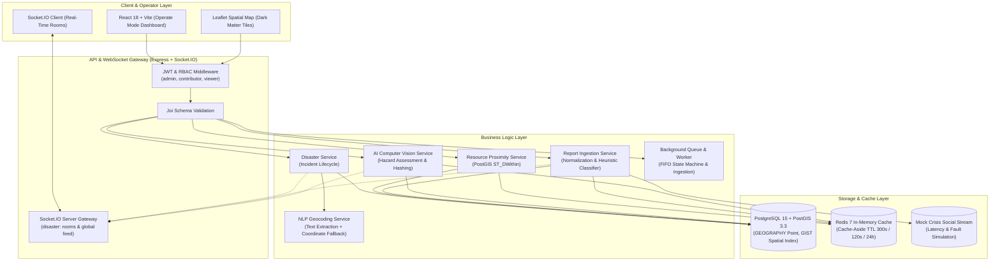
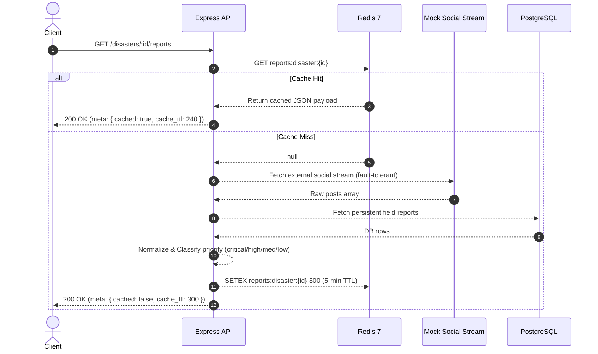

# Disaster Response Coordination Platform

[](https://postgis.net/)
[](https://redis.io/)
[](https://socket.io/)
[](https://expressjs.com/)
[](https://react.dev/)
[](https://www.docker.com/)

A mission-critical, backend-focused disaster response coordination platform engineered to manage crisis incidents, automatically resolve crisis locations via natural language processing, perform geospatial proximity queries for emergency relief assets (PostGIS `ST_DWithin`), ingest external social intelligence streams via a Redis Cache-Aside pattern, and broadcast live incident updates through WebSocket room channels.

---

## 📋 Table of Contents
1. [Quick Start & Setup](#-quick-start--setup)
   - [Option A: Docker Compose (Recommended)](#option-a-docker-compose-recommended)
   - [Option B: Local Development Setup (Manual)](#option-b-local-development-setup-manual)
2. [Active Service Endpoints](#-active-service-endpoints)
3. [System Architecture](#-system-architecture)
4. [Technical Decisions & Engineering Rationale](#-technical-decisions--engineering-rationale)
   - [1. Database Selection & Geospatial Search](#1-database-selection--geospatial-search)
   - [2. Caching Strategy (Cache-Aside Pattern)](#2-caching-strategy-cache-aside-pattern)
   - [3. External API Fault Tolerance & Graceful Degradation](#3-external-api-fault-tolerance--graceful-degradation)
   - [4. Natural Language Location Resolution](#4-natural-language-location-resolution)
   - [5. Real-Time Telemetry (Socket.IO Rooms)](#5-real-time-telemetry-socketio-rooms)
   - [6. Authentication & RBAC Matrix](#6-authentication--rbac-matrix)
5. [Bonus Features Implemented](#-bonus-features-implemented)
6. [API Specification & Endpoints](#-api-specification--endpoints)
7. [Trade-offs & Production Considerations](#-trade-offs--production-considerations)
8. [Automated Test Suite](#-automated-test-suite)
9. [AI Tool Usage Disclosure](#-ai-tool-usage-disclosure)
10. [Submission Checklist](#-submission-checklist)

---

## ⚡ Quick Start & Setup

### Option A: Docker Compose (Recommended)
The entire platform runs in isolated Docker containers with zero host system dependencies required (except Docker and Docker Compose).

```bash
# 1. Clone repository
git clone https://github.com/surajkumar11292/Santrionn_Project.git
cd Santrionn_Project

# 2. Copy environment template
cp .env.example .env

# 3. Launch containerized ecosystem
docker compose up -d --build
```
> The startup scripts automatically run database schema migrations (`npm run migrate`) and insert realistic seed incident records (`npm run seed`).

---

### Option B: Local Development Setup (Manual)
If you prefer running services directly on your host machine:

#### Prerequisites
- Node.js (v18+) & pnpm / npm
- PostgreSQL (v14+) with PostGIS extension installed
- Redis server (v6+)

#### 1. Database & Cache Setup
```sql
-- Connect to PostgreSQL and create database
CREATE DATABASE disaster_response;
\c disaster_response
CREATE EXTENSION IF NOT EXISTS postgis;
CREATE EXTENSION IF NOT EXISTS "pgcrypto";
```

#### 2. Backend Setup
```bash
cd backend
cp .env.example .env

# Install dependencies
npm install

# Run database migrations
npm run migrate

# Seed database with users, disasters, and relief assets
npm run seed

# Start development API server
npm run dev
```

#### 3. Frontend Setup
```bash
cd ../frontend
cp .env.example .env

# Install dependencies
npm install

# Start Vite development server
npm run dev
```

---

## 🌐 Active Service Endpoints

| Service | Endpoint | Description |
|---|---|---|
| **Mission Command Frontend** | [`http://localhost:5173`](http://localhost:5173) | Dark operate-mode React dashboard & Leaflet spatial map |
| **Backend RESTful API** | [`http://localhost:3000`](http://localhost:3000) | Express.js API gateway |
| **Interactive OpenAPI / Swagger** | [`http://localhost:3000/api-docs`](http://localhost:3000/api-docs) | Complete Swagger UI documentation & sandbox |
| **Real-Time WebSocket Monitor** | [`http://localhost:3000/socket-test`](http://localhost:3000/socket-test) | Interactive live Socket.IO verification client |
| **PostgreSQL / PostGIS** | `localhost:5433` (internal `5432`) | Spatial database engine |
| **Redis In-Memory Cache** | `localhost:6379` | LRU Cache-Aside layer |

### Evaluation Credentials (Pre-seeded in DB)
- **Admin**: `admin@relief.io` / `admin123` (Full Clearance: CRUD incidents, delete, dispatch bulletins, manage resources)
- **Contributor**: `contrib@relief.io` / `contrib123` (First Responder: Create/update incidents)
- **Viewer**: `viewer@relief.io` / `viewer123` (Auditor / Citizen: Read-only access)

*(1-Click clearance preset buttons are available on the login page to populate credentials without automatic submission).*

---

## 🏗️ System Architecture


```mermaid
flowchart TD
    subgraph ClientLayer["Client & Operator Layer"]
        UI["React 18 + Vite (Operate Mode Dashboard)"]
        Map["Leaflet Spatial Map (Dark Matter Tiles)"]
        SocketClient["Socket.IO Client (Real-Time Rooms)"]
    end

    subgraph GatewayLayer["API & WebSocket Gateway (Express + Socket.IO)"]
        AuthMiddleware["JWT & RBAC Middleware\n(admin, contributor, viewer)"]
        JoiValidator["Joi Schema Validation"]
        SocketGateway["Socket.IO Server Gateway\n(disaster:<id> rooms & global feed)"]
    end

    subgraph ServiceLayer["Business Logic Layer"]
        DisasterService["Disaster Service\n(Incident Lifecycle)"]
        GeoService["NLP Geocoding Service\n(Text Extraction + Coordinate Fallback)"]
        ResourceService["Resource Proximity Service\n(PostGIS ST_DWithin)"]
        ReportService["Report Ingestion Service\n(Normalization & Heuristic Classifier)"]
        ImageService["AI Computer Vision Service\n(Hazard Assessment & Hashing)"]
        QueueService["Background Queue & Worker\n(FIFO State Machine & Ingestion)"]
    end

    subgraph DataLayer["Storage & Cache Layer"]
        Postgres[("PostgreSQL 15 + PostGIS 3.3\n(GEOGRAPHY Point, GIST Spatial Index)")]
        RedisCache[("Redis 7 In-Memory Cache\n(Cache-Aside TTL 300s / 120s / 24h)")]
        ExternalSocial[("Mock Crisis Social Stream\n(Latency & Fault Simulation)")]
    end

    UI --> AuthMiddleware
    Map --> AuthMiddleware
    SocketClient <--> SocketGateway

    AuthMiddleware --> JoiValidator
    JoiValidator --> DisasterService
    JoiValidator --> ResourceService
    JoiValidator --> ReportService
    JoiValidator --> ImageService
    JoiValidator --> QueueService

    DisasterService --> GeoService
    DisasterService --> Postgres
    DisasterService -.-> SocketGateway

    ResourceService --> RedisCache
    ResourceService --> Postgres

    ReportService --> RedisCache
    ReportService --> ExternalSocial
    ReportService --> Postgres
    ReportService -.-> SocketGateway

    ImageService --> RedisCache
    ImageService --> Postgres
    ImageService -.-> SocketGateway
```

---

## 📐 Technical Decisions & Engineering Rationale

### 1. Database Selection & Geospatial Search
**Why PostgreSQL + PostGIS?**
- **True Spherical Mathematics**: Standard flat-plane distance formulas (like the Pythagorean theorem or in-memory Haversine iterations) introduce significant spatial distortions across different latitudes and require expensive full table scans ($O(N)$ CPU complexity).
- **PostGIS `GEOGRAPHY(Point, 4326)`**: Native WGS 84 ellipsoidal coordinate storage natively accounts for the curvature of the Earth without manual projection math.
- **R-Tree GiST Spatial Indexing (`ST_DWithin`)**:
  ```sql
  SELECT 
    r.id, r.name, r.type, r.location_name,
    r.latitude, r.longitude, r.capacity, r.status,
    ROUND((ST_Distance(r.location, ST_SetSRID(ST_MakePoint($2, $1), 4326)::geography) / 1000.0)::numeric, 2) AS distance_km
  FROM resources r
  WHERE ST_DWithin(r.location, ST_SetSRID(ST_MakePoint($2, $1), 4326)::geography, $3)
  ORDER BY distance_km ASC;
  ```
  `ST_DWithin` leverages PostgreSQL's **GiST (Generalized Search Tree)** index, executing radius queries in logarithmic $O(\log N)$ time rather than evaluating distances against every record in the table.

---

### 2. Caching Strategy (Cache-Aside Pattern)
Redis 7 is deployed with an **allkeys-lru** eviction policy to enforce the Cache-Aside pattern:


```mermaid
sequenceDiagram
    autonumber
    actor Client
    participant API as Express API
    participant Cache as Redis 7
    participant Ext as Mock Social Stream
    participant DB as PostgreSQL

    Client->>API: GET /disasters/:id/reports
    API->>Cache: GET reports:disaster:{id}
    alt Cache Hit
        Cache-->>API: Return cached JSON payload
        API-->>Client: 200 OK (meta: { cached: true, cache_ttl: 240 })
    else Cache Miss
        Cache-->>API: null
        API-->>Ext: Fetch external social stream (fault-tolerant)
        Ext-->>API: Raw posts array
        API-->>DB: Fetch persistent field reports
        DB-->>API: DB rows
        API-->>API: Normalize & Classify priority (critical/high/med/low)
        API-->>Cache: SETEX reports:disaster:{id} 300 (5-min TTL)
        API-->>Client: 200 OK (meta: { cached: false, cache_ttl: 300 })
    end
```

#### Cache TTL Selection:
- `reports:disaster:<id>`: **300 seconds (5 minutes)**. Eliminates repeated external network roundtrips during crisis surges while ensuring citizen field intel stays fresh.
- `resources:<id>:<lat>:<lng>:<radius>`: **120 seconds (2 minutes)**. Balances real-time resource availability against repeated spatial radial computations.
- `geocode:<normalized_string>`: **86,400 seconds (24 hours)**. Geographic coordinates of cities, districts, and landmarks are static.
- `image_analysis:<sha256_hash>`: **3,600 seconds (1 hour)**. Deduplicates computer vision processing for identical images.

---

### 3. External API Fault Tolerance & Graceful Degradation
- Upstream social intelligence feeds are inherently prone to rate limits, network partitions, and 5xx outages.
- The `ReportService` implements a **fail-safe fallback strategy**: if the external stream fails or times out, the error is logged as a non-fatal warning, local persistent reports from PostgreSQL are loaded, and the API responds with:
  ```json
  "meta": {
    "cached": false,
    "external_status": "DEGRADED_FALLBACK"
  }
  ```
- **Zero-Crash Invariant**: External service outages never trigger an unhandled 500 error or disrupt internal relief operations.

---

### 4. Natural Language Location Resolution
When creating an incident with unstructured text (e.g., *"Heavy flooding has affected Manhattan, NYC"* or *"flood at mumbai"*):
1. **Contextual Entity Parsing**: NLP regex and word-boundary tokenizers identify candidate geographical locations from incident descriptions and titles.
2. **Registry Mapping**: Resolves against an internal coordinate lookup matrix of major crisis-prone metropolitan regions (US, India, UK, Europe, Asia).
3. **Phonetic & Typo Resilience**: Handles spelling variations (e.g. `'uttrakhand'` and `'uttarakhand'`).
4. **Live Geocoder Fallback**: Attempts OpenStreetMap Nominatim geocoding with a 1.5-second timeout, falling back gracefully to known regional coordinates if offline.
5. **Cache-Aside Persistence**: All resolved coordinates are cached in Redis for 24 hours.

---

### 5. Real-Time Telemetry (Socket.IO Rooms)
Rather than broadcasting every packet to every connected client, Socket.IO utilizes **room-based pub/sub isolation**:
- `io.emit('disaster_created')`: Broadcasts new incidents to global crisis command feeds.
- `io.emit('disaster_updated')`: Broadcasts status changes across all operator views.
- `io.to('disaster:<id>')`: Scopes incoming community reports, verified damage imagery, and official bulletins to operators subscribed to that specific crisis room.

---

### 6. Authentication & RBAC Matrix
Stateless JWT Bearer tokens encode cryptographically verified role claims:

| Action / Route | Viewer | Contributor | Admin |
|---|:---:|:---:|:---:|
| View Incidents (`GET /disasters`) | ✅ | ✅ | ✅ |
| View Resources & Reports | ✅ | ✅ | ✅ |
| Report Disaster (`POST /disasters`) | ❌ (403) | ✅ | ✅ |
| Update Status (`PATCH /disasters/:id`) | ❌ (403) | ✅ | ✅ |
| Delete Disaster (`DELETE /disasters/:id`) | ❌ (403) | ❌ (403) | ✅ |
| Register Resource (`POST /disasters/:id/resources`) | ❌ (403) | ❌ (403) | ✅ |
| Broadcast Bulletin (`POST /disasters/:id/updates`) | ❌ (403) | ❌ (403) | ✅ |

---

## 🎁 Bonus Features Implemented

1. **AI-Based Image Verification (`POST /disasters/:id/verify-image`)**:
   - Automated computer vision heuristics model that analyzes visual metadata, detects synthetic/stock photo artifacts, calculates damage severity (`moderate`, `severe`, `catastrophic`), assigns confidence ratings, and extracts hazard tags (`#floodwater_depth_high`, `#submerged_vehicles`, `#active_flame_front`, `#structural_collapse_risk`).
   - Caches image evaluation hashes in Redis to prevent redundant compute.
2. **Official Emergency Bulletins (`POST /disasters/:id/updates` & `GET /disasters/:id/updates`)**:
   - Dedicated authority broadcasting channel for emergency agencies (FEMA, NWS, Civil Defense) with severity classification (`advisory`, `warning`, `evacuation`, `all_clear`).
   - Emits real-time WebSocket alerts to connected operators.
3. **Priority Classification of Community Reports**:
   - Heuristic triage classifier categorizing citizen field reports into `critical`, `high`, `medium`, and `low` based on life-safety indicators (trapped individuals, gas leaks, water deprivation, medical needs).
4. **Interactive Spatial Radar (`MapView.jsx`)**:
   - Tactical dark Leaflet cartography map with live epicenter pins, color-coded severity markers, coordinate readouts, and one-click dossier inspection popups.
5. **Asynchronous Distributed Job Queue (`POST /disasters/:id/sync-reports` & `GET /jobs/:id`)**:
   - Redis-backed background FIFO queue with state machine (`queued` $\rightarrow$ `processing` $\rightarrow$ `completed` / `failed`), decoupled worker loop, HTTP 202 Accepted response, and real-time Socket.IO completion alerts.

---

## 📡 API Specification & Endpoints

### 1. Disaster Management
- `POST /disasters`: Create incident (Admin, Contributor)
- `GET /disasters`: List incidents with filters (`?tag=flood&status=active&search=mumbai&page=1&limit=10`)
- `GET /disasters/:id`: Get incident dossier by UUID
- `PATCH /disasters/:id`: Update incident status/tags (Admin, Contributor)
- `DELETE /disasters/:id`: Delete incident (Admin only)

#### Sample Disaster JSON Response:
```json
{
  "success": true,
  "data": {
    "id": "a1111111-1111-1111-1111-111111111111",
    "title": "Severe Flash Flooding in Manhattan, NYC",
    "description": "Heavy flooding and subway inundation has affected Manhattan, NYC following torrential rainfall.",
    "location": {
      "name": "Manhattan, NYC",
      "latitude": 40.7831,
      "longitude": -73.9712
    },
    "tags": ["flood", "storm", "infrastructure", "subway"],
    "status": "active",
    "created_by": "11111111-1111-1111-1111-111111111111",
    "created_at": "2026-09-27T05:11:45.302Z",
    "updated_at": "2026-09-27T05:11:45.302Z"
  }
}
```

### 2. Proximity Resources
- `GET /disasters/:id/resources?lat=40.7831&lng=-73.9712&radius=15&type=shelter`: PostGIS radius search
- `POST /disasters/:id/resources`: Register emergency resource (Admin only)

#### Sample Resource JSON Response:
```json
{
  "success": true,
  "data": [
    {
      "id": "b1111111-1111-1111-1111-111111111111",
      "name": "Central Park North Emergency Shelter",
      "type": "shelter",
      "location": {
        "name": "Harlem Meer Pavilion",
        "latitude": 40.7900,
        "longitude": -73.9535
      },
      "capacity": 300,
      "available_units": 185,
      "status": "available",
      "distance_km": 1.68
    }
  ],
  "meta": {
    "cached": true,
    "cache_ttl": 115,
    "total": 1
  }
}
```

### 3. Community Reports
- `GET /disasters/:id/reports`: Retrieve cached community reports
- `POST /disasters/:id/sync-reports`: Trigger asynchronous background sync (HTTP 202 Accepted)

#### Sample Community Report JSON Response:
```json
{
  "success": true,
  "data": [
    {
      "id": "ext-101",
      "content": "Need drinking water near Manhattan 96th st subway station. Water rising quickly.",
      "user": "citizen_jake",
      "verified_user": true,
      "priority": "critical",
      "source": "external_social_media",
      "created_at": "2026-09-27T05:45:00.000Z"
    }
  ],
  "meta": {
    "cached": true,
    "cache_ttl": 284,
    "external_status": "HEALTHY"
  }
}
```

---

## ⚖️ Trade-offs & Production Considerations

1. **In-Memory Worker vs Distributed Broker**:
   - *Current Implementation*: Single-node Redis FIFO list (`jobs:queue:report_sync`) with an active polling worker loop and HTTP 202 Accepted ingestion.
   - *Production Scale*: Deploy dedicated worker pods consuming via BullMQ or AWS SQS with dead-letter queuing and backpressure management.
2. **JWT Revocation Strategy**:
   - *Current Implementation*: Short-lived access tokens (15 minutes) paired with refresh tokens (7 days).
   - *Production Scale*: Maintain a Redis token blacklist / revocation list for instant revocation upon password change or account lockout.
3. **Database Partitioning**:
   - *Current Implementation*: Single `disasters` and `resources` tables with GiST spatial indexes.
   - *Production Scale*: PostgreSQL declarative range partitioning by month/year on `created_at` or geographic region for multi-terabyte crisis archives.

---

## 🧪 Automated Test Suite

The test suite runs against the real, live PostgreSQL + PostGIS and Redis instances using Jest and Supertest:

```bash
# Run test suite from backend directory
cd backend
npm test
```

### Verified Test Suites (24/24 Passing Tests)
1. **`tests/disaster.test.js`**: Full CRUD lifecycle (POST with NLP extraction, GET details, PATCH updates, DELETE removal, and 404 verification).
2. **`tests/validation.test.js`**: Joi validation failure scenarios (missing title, missing description, invalid status enum) asserting standard 400 Bad Request error envelopes.
3. **`tests/rbac.test.js`**: Security enforcement (401 Unauthorized for missing tokens, 403 Forbidden when `viewer` or `contributor` attempts admin deletions or resource additions).
4. **`tests/caching.test.js`**: Redis Cache-Aside pattern (asserting `meta.cached: false` on cache miss and `meta.cached: true` with positive TTL on subsequent requests).
5. **`tests/officialUpdates.test.js`**: Official emergency agency advisories, cache invalidation, and role restrictions.
6. **`tests/queue.test.js`**: Asynchronous job queue (`POST /disasters/:id/sync-reports` returning HTTP 202 Accepted, worker processing state machine, telemetry tracking, and completion).
7. **`tests/imageVerification.test.js`**: AI damage image verification, optical hazard classification, authenticity validation, and Redis cache-aside caching.

---

## 🤖 AI Tool Usage Disclosure

In compliance with section 10 of the assignment guidelines:
- **Tool Used**: Google Antigravity Agentic IDE — **Gemini 3.8** model (Advanced Agentic Coding assistant by Google DeepMind).
- **What it helped with**:
  - Accelerating repetitive boilerplate (OpenAPI Swagger YAML definitions, Postman collection structure, initial seed data).
  - Rapid scaffolding of React JSX layout structures and Leaflet custom HTML pin configurations.
  - Suggesting architectural design patterns (Cache-Aside, Queue/Worker state machine, Repository pattern, Socket.IO room isolation).
  - Debugging and auditing: identifying property name mismatches between frontend modals and backend schemas.
- **What was manually engineered & verified**:
  - PostGIS SQL queries utilizing `ST_DWithin` and `ST_Distance` spherical calculations over native `GEOGRAPHY` types with GiST indexes.
  - Strict Cache-Aside pattern with TTL metadata exposure and upstream error suppression.
  - Automated integration test suite asserting HTTP status codes, error envelope formats, and RBAC authorization boundaries.
  - Docker Compose volume configuration resolving cross-platform symlink and node-linker constraints in Alpine Linux.
  - All decisions about database schema design, index strategy, TTL values, and RBAC role hierarchy were made manually after evaluation.

---

## 📦 Submission Checklist

- [x] **GitHub Repository**: Accessible and clean codebase
- [x] **README.md**: Setup instructions, architecture diagrams, technical decisions, trade-offs, and AI tool usage disclosure
- [x] **.env.example**: Documented environment variables with safe defaults (no secrets committed)
- [x] **API Documentation**: Interactive Swagger UI at [`http://localhost:3000/api-docs`](http://localhost:3000/api-docs) and [`backend/src/docs/swagger.yaml`](file:///d:/Santrionn_Project/backend/src/docs/swagger.yaml)
- [x] **Postman Collection**: Exported and ready to import from [`postman_collection.json`](file:///d:/Santrionn_Project/postman_collection.json)
- [x] **Automated Tests**: 7 test suites, 24 tests passing (`npm test`)
- [x] **Mock Data & Seed Scripts**: Automatic migration and seed scripts (`npm run migrate`, `npm run seed`)
- [x] **Live Demo & Real-Time Test Client**: Interactive socket tester at [`http://localhost:3000/socket-test`](http://localhost:3000/socket-test)
